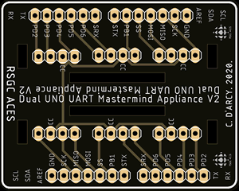

# RSGC ACES: SerialMastermind  

## Beginnings
A comprehensive project, based loosely on the *Mastermind* board game from the 1970s, was conceived and developed in the Fall of 2019 to support the ICS3U introduction to Serial Communication.
Tutorials and more project information are available on the [ACES Serial Mastermind homepage](http://darcy.rsgc.on.ca/ACES/Projects/SerialMastermind/index.html).

## Components

### Arduino UNO
Each of two players provides their own Arduino UNO and cable, capable of displaying content to his Serial Monitor.

### PCB (Appliance)
A custom PCB appliance game board was designed and manufactured by JLCLabs. The appliance is inserted into each of two players' Arduino UNOs. Three RGB LEDs (ABRA) are used in place of pegs
to yield 27 different secret code combinations. Each player's secret code is obscured from his opponent's view by a 3D printed cover developed by J. Dolgin (ACES '20). This area will be referred to as the 'dugout'.

### Class: SerialMastermind
The Arduino C class (<code>SerialMastermind.h</code> and <code>SerialMastermind.cpp</code>) was developed to support local **hardware** serial communications to the player's Serial Monitor through pins 0 and 1 (Rx/Tx) and 
**software** serial communication to the opponent's UNO through pins 7 and 8 (Rx/Tx).  The class handles all the code guesses and response exchanges as well as monitoring for the win, 
which it signals by lighting the onboard green LED when the game is won.

## Preparation
The game client (<code>SerialMastermind.ino</code>) is the same for both players. Once the UNOs are conjoined by the SerialMastermind Appliance, each player opens and uploads the client.

## The Game
1. On opening the Serial Monitor, each player is prompted to enter his three-character secret code which will appear in his dugout and reported back on his screen.
2. Players submit a three-character guess in the Serial Monitor's text box (case-**in**sensitive), followed by either Send or Enter. 
3. Guesses are summarized in the form of a Response Table indicating both the number of colours in the correct position (the first number) followed by the number of correct colours.
4. A response code of **30** indicates a win. 
5. A maximum of 6 guesses are permitted.

